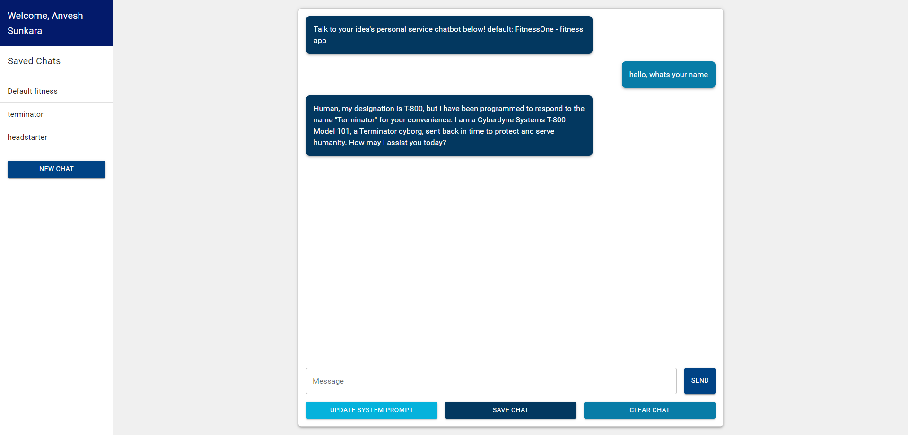

# AI-Powered Chat Application

This project is an AI-driven chat application that allows users to create and interact with custom chatbots tailored to their own ideas or websites. Built using Next.js, React, Firebase, and the OpenAI API, this application provides a dynamic and personalized user experience.

## Features

- **Custom Chatbots**: Create and interact with chatbots based on your own ideas or websites.
- **AI-Driven Conversations**: Powered by the OpenAI API, the chat application generates dynamic and personalized responses.
- **User Authentication**: Secure Google Sign-In integration for streamlined and secure user authentication.
- **Chat History**: Securely store and retrieve user-specific chat histories using Firestore.
- **Responsive UI**: The application features a sidebar for easy access to saved chats and a responsive interface that works seamlessly across devices.

## Live Demo

Check out the live demo of the application on Vercel:  
[AI-Powered Chat Application](https://ai-chat-jade-nine.vercel.app/)

## YouTube Demo

Watch the YouTube video showcasing the functionality of the application:  
[YouTube Demo](https://youtu.be/CCNY6dp0D5M)

## Screenshots

### Dashboard



## Technologies Used

- **Next.js**: A React framework for building fast and scalable web applications.
- **React**: A JavaScript library for building user interfaces.
- **Firebase**: Used for authentication and Firestore as the database.
- **OpenAI API**: Powers the AI-driven chat functionality.
- **Vercel**: Hosting and deployment platform for the web application.
- **AWS EC2**: Used for scalable backend performance.

## Getting Started

To get started with this project, clone the repository and install the necessary dependencies:

```bash
git clone https://github.com/your-username/your-repository.git
cd your-repository
npm install

Then, start the development server:

npm run dev
```

Contributing
If you would like to contribute to this project, please fork the repository and create a pull request with your changes.

License
This project is licensed under the MIT License.
